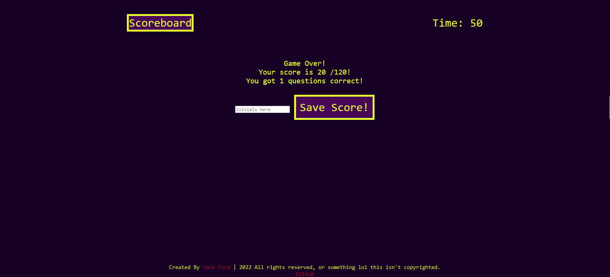

# Code Quiz
A responsive coding quiz about, and made with Javascript.

## Screenshot

## Technologies Used
 -HTML - for foundation of the page.
 - CSS - for style of the page.
 -Javascript - for logic and functionalityof the page.

## Summary
When the start button is clicked, the page should begin to question the user about aspects of their Javascript knowledge, and present them with multiple answer buttons to click on. When the user clicks the correct answer, their score should go up by 20 points, and the timer should not have time subtracted. When the user selects an incorrect answer, their score should stay the same, while their timeis subtracted by 15 seconds. After all questions have been answered, the user should be able to save their score and initials to the local storage, and retreive it upon revisiting the page.

## Deployed Link
*[See live page](https://saintshay.github.io/code-quiz//)

## Creator Links
[LinkedIn](https://www.linkedin.com/in/jack-ford-a0ab0422a/)
[GitHub](https://github.com/SaintShay)